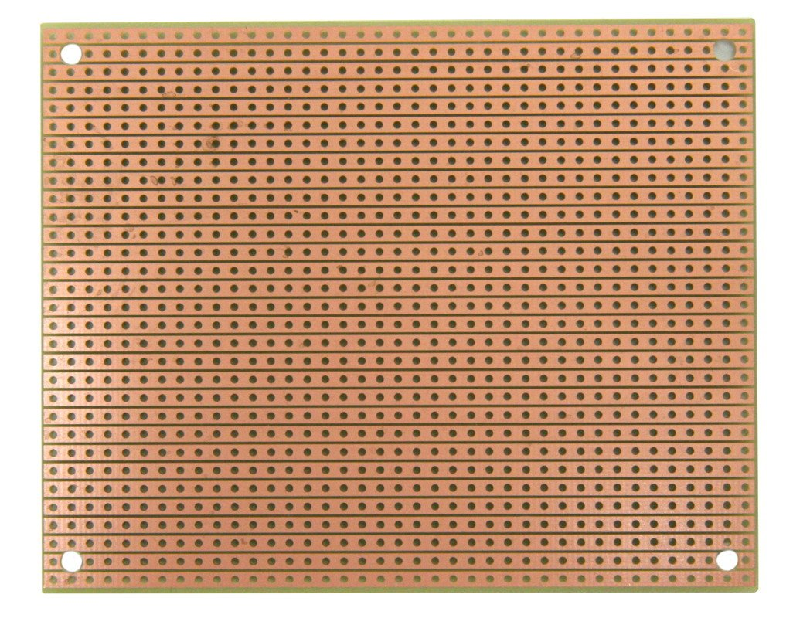
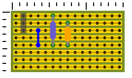

# Stripboard

## Overview

Stripboard.js is a stripboard / breadboard renderer that reads a circuit layout definition
specified in JSON and renders it in SVG.

This can be used to lay out components, wires and cuts on a prototyping breadbord such as
the [Busboard ST1 Stripboard](https://www.amazon.com/Two-Pack-StripBoard-Uncut-Strips-3-15in/dp/B00PBGFD5A)
shown below.

 

## License

Stripboard is released under the [GNU GPL v3.0 License](LICENSE).

## Usage

I'll demonstrate how to use Stripboard.js with a fairly minimal sample circut.

A circuit is defined in JSON and may include cuts, wires and components.  For this example, we are 
laying out a simple [low-pass RC filter](https://en.wikipedia.org/wiki/Low-pass_filter) on a stripboard.
The circuit schematic _[By Inductiveload - Own work, Public Domain,
https://commons.wikimedia.org/w/index.php?curid=5266901]_ is shown below.


This circuit layout is defined as:

```
let CIRCUIT = {
    dimensions: { width: 1.5, height: 0.8 },
    wires: [ { from: "C3", to: "E3" } ],
    components: [
        { type: "header", from: "A1", to: "C1" },
        { label: "R1", type: "resistor", from: "A5", to: "E5", },
        { label: "C1", type: "capacitor", from: "B7", to: "E7", },
    ]
};
```

The rendered stripboard layout is:



The Header element in column 1 (the first column is column 0) would include Vin, GND and Vout pins.
The Resistor in column 5 is between Vin and Vout (connected to the Vout pin by the wire of column
3), and the Capacitor in column 7 sits between GND and Vout.

A live rendering of this circuit is at https://pearsonalan.github.io/Stripboard/minimal-circuit.html.
